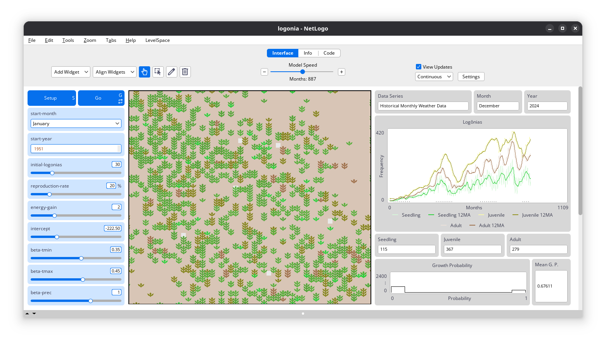

# Logônia

<!-- Quarto render -->

<!-- badges: start -->
[](https://www.repostatus.org/#wip)
[](https://www.gnu.org/licenses/gpl-3.0)
<!-- badges: end -->

## Overview

`Logônia` is a [NetLogo](https://www.netlogo.org) model for simulating
the growth response of a fictional plant species named Logônia
(*netlogia brasiliensis*) to different climatic conditions. The model
incorporates climate data from [WorldClim 2.1](https://worldclim.org/)
and serves as fun example on how to integrate the
[`LogoClim`](https://github.com/sustentarea/logoclim) model into other
NetLogo models using the NetLogo
[`LevelSpace`](https://ccl.northwestern.edu/netlogo/docs/ls.html)
extension.

> If you find this project useful, please consider giving it a star!
> [](https://github.com/sustentarea/Logônia/)



## How It Works

`Logônia` operates on a grid of patches, where each patch represents the
soil were the Logônia plant species grow. Each patch corresponds to a
specific geographical area and stores historical data values for
precipitation and minimum and maximum temperature.

The model was created to serve as an example of integration of climate
data from [WorldClim 2.1](https://worldclim.org/) using the
[`LogoClim`](https://github.com/sustentarea/logoclim) NetLogo model. The
climate data influences the growth of the species, adding a layer of
complexity to the simulation.

The data is derived from [WorldClim 2.1](https://worldclim.org/)
historical monthly weather data series (1951-2024) ([Fick & Hijmans,
2017](https://doi.org/10.1002/joc.5086)) for a selected region of the
Amazon forest. This data can be reproduced using the Quarto notebooks in
the `qmd` folder of this repository, which are adapted from the
notebooks provided by the
[`LogoClim`](https://github.com/sustentarea/logoclim) model.

## How to Use It

### Setup

To get started, ensure you have [NetLogo](https://www.netlogo.org)
installed. This model was developed using NetLogo 7.0.0, so it is
recommended to use this version or later.

The model relies on the `LevelSpace`
([`ls`](https://ccl.northwestern.edu/netlogo/docs/ls.html)) NetLogo
extension, that is automatically installed when the model is run for the
first time.

#### Downloading the Model

You can download the latest release of the model from its [GitHub
Releases page](https://github.com/sustentarea/logonia/releases/latest).
For the development version, you can clone or download this [GitHub
repository](https://github.com/sustentarea/logonia/) directly.

> [!IMPORTANT]
> Download all repository files, not only the `nlogox` folder.

#### Running the Model

Once everything is set, open the `logonia.nlogox` file located in the
`nlogox` folder to start exploring!

Refer to the `Info` tab in the model for additional details.

## How to Cite

To cite `Logônia` please use the following format:

Vartanian, D., Garcia, L., & Carvalho, A. M. (2025). *Logônia: Netlogia
brasiliensis growth response model* \[Computer software\].
<https://doi.org/10.17605/OSF.IO/>

A BibTeX entry for LaTeX users is:

``` latex
@Misc{vartanian2025,
  title = {{Logônia}: <span class="italic">Netlogia brasiliensis</span> growth response model},
  author = {{Daniel Vartanian} and {Leandro Garcia} and {Aline Martins de Carvalho}},
  year = {2025},
  doi = {10.17605/OSF.IO/},
  note = {Computer software}
}
```

## License

[](https://www.gnu.org/licenses/gpl-3.0)

``` text
Copyright (C) 2025 Daniel Vartanian

{Logônia} is free software: you can redistribute it and/or modify it under the
terms of the GNU General Public License as published by the Free Software
Foundation, either version 3 of the License, or (at your option) any later
version.

This program is distributed in the hope that it will be useful, but WITHOUT ANY
WARRANTY; without even the implied warranty of MERCHANTABILITY or FITNESS FOR A
PARTICULAR PURPOSE. See the GNU General Public License for more details.

You should have received a copy of the GNU General Public License along with
this program. If not, see <https://www.gnu.org/licenses/>.
```

## Acknowledgments

We gratefully acknowledge [Stephen E.
Fick](https://orcid.org/0000-0002-3548-6966), [Robert J.
Hijmans](https://orcid.org/0000-0001-5872-2872), and the entire
[WorldClim](https://worldclim.org/) team for their outstanding work in
creating and maintaining the WorldClim datasets.

<table>
  <tr>
    <td width="30%">
      <br/>
      <br/>
      <p align="center">
        <a href="https://www.fsp.usp.br/sustentarea/">
          
        </a>
      </p>
      <br/>
    </td>
    <td width="70%">
      <p>
        This work was developed with support from the 
        <a href="https://www.fsp.usp.br/sustentarea/">Sustentarea</a>
         Research and Extension Center at the University of São Paulo (<a href="https://www5.usp.br/">USP</a>).
      </p>
    </td>
  </tr>
</table>

<table>
  <tr>
    <td width="30%">
      <br/>
      <p align="center">
        <a href="https://www.gov.br/cnpq/">
          
        </a>
      </p>
      <br/>
    </td>
    <td width="70%">
      <p>
        This work was supported by the Department of Science and 
        Technology of the Secretariat of Science, Technology, and Innovation 
        and of the Health Economic-Industrial Complex (<a href="https://www.gov.br/saude/pt-br/composicao/sectics/">SECTICS</a>)  of the <a href="https://www.gov.br/saude/pt-br/composicao/sectics/">Ministry of Health</a> 
        of Brazil, and the National Council for Scientific and 
        Technological Development (<a href="https://www.gov.br/cnpq/">CNPq</a>) (grant no. 444588/2023-0).
      </p>
    </td>
  </tr>
</table>
