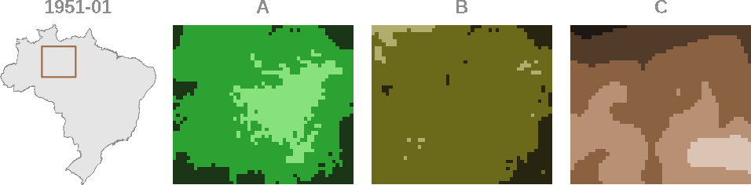

# Logônia 

<!-- Quarto render -->

<!-- badges: start -->
[](https://www.repostatus.org/#active)
[](https://www.comses.net/codebases/4f2be13a-3957-4537-bf64-3fad96ba271f/)
[](https://doi.org/10.17605/OSF.IO/TPY7S)
[](https://fairsoftwarechecklist.net/v0.2?f=31&a=30113&i=32300&r=123)
[](https://fair-software.eu)
[](https://www.gnu.org/licenses/gpl-3.0)
<!-- badges: end -->

## Overview

`Logônia` is a [NetLogo](https://www.netlogo.org) model that simulates
the growth response of a fictional plant, logônia, under different
climatic conditions. The model uses climate data from [WorldClim
2.1](https://worldclim.org/) and demonstrates how to integrate the
[`LogoClim`](https://github.com/sustentarea/logoclim) model through the
[`LevelSpace`](https://ccl.northwestern.edu/netlogo/docs/ls.html)
extension.

> If you find this project useful, please consider giving it a star!
> [](https://github.com/sustentarea/logonia/)

<p align="center">
  
</p>

## How It Works

`Logônia` runs on a grid of patches, where each patch represents a piece
of soil that can host a plant. Patches correspond to a specific
geographic area and store historical climate data.

Each simulation step represents *one month*. Over time, plants *grow*,
*reproduce*, and *age*. These processes are controlled by sliders on the
model’s interface. Climate conditions directly influence growth
probability, adding realism and complexity to the simulation.

<p align="center">
  
</p>

### Climate Data

The model uses *Historical Monthly Weather Data* from [WorldClim
2.1](https://worldclim.org/) ([Fick & Hijmans,
2017](https://doi.org/10.1002/joc.5086)) for a region of the **Brazilian
Amazon Forest**.

This dataset provides 12 monthly values per year for 1951–2024, based on
[downscaled](https://worldclim.org/data/downscaling.html) data from
[CRU-TS-4.09](https://crudata.uea.ac.uk/cru/data/hrg/cru_ts_4.09/),
developed by the [Climatic Research
Unit](https://www.uea.ac.uk/groups-and-centres/climatic-research-unit)
at the [University of East Anglia](https://www.uea.ac.uk/) ([Harris et
al., 2020](https://doi.org/10.1038/s41597-020-0453-3)). The variables
are: *Average Minimum Temperature (°C)* (**A**), *Average Maximum
Temperature (°C)* (**B**), and *Total Precipitation (mm)* (**C**).

<p align="center">
  
</p>

The dataset can be reproduced using [Quarto](https://quarto.org/)
notebooks in the `qmd` folder of the model repository, adapted from
those in the [`LogoClim`](https://github.com/sustentarea/logoclim)
model.

### Energy and Growth Probability

Growth probability is determined by a [logistic
regression](https://en.wikipedia.org/wiki/Logistic_regression) model
that incorporates patch-level climate variables. The probability follows
the equation below:

$$
p(\text{tmin, tmax, prec}) = \cfrac{1}{1 + e^{- (\beta_{0} + \beta_{\text{tmin}} \text{tmin} + \beta_{\text{tmax}} \text{tmax} + \beta_{\text{prec}} \text{prec})}}
$$

A logônia gains or loses energy at each step according to the following
rules:

- If a random number between `0` and `1` is *less than* or *equal to*
  the growth probability for the current patch, the plant gains the
  number of energy points defined by the `energy-gain` slider.
- If the probability is *below* `0.25` and does not meet the above
  condition, the plant loses `1` energy point.
- Otherwise, its energy remains unchanged.

If a plant gets to `0` points of energy it dies.

### Growth Phases

A logônia plant develops through three phases: *seedling*, *juvenile*,
and *adult*. Each has distinct shapes and energy thresholds.

<p align="center">
  
</p>

As a *seedling*, the logônia can only grow and age. Once it accumulates
`10` energy points, it becomes a *juvenile*.

As a *juvenile*, it continues to grow and age. When it reaches `30`
energy points, it advances to its final stage: an *adult*.

As an *adult*, the logônia gains the ability to reproduce.

### Reproduction

Adult plants can reproduce asexually by randomly colonizing unoccupied
patches:

- If an adult has at least `30` energy points, and a random number
  between `0` and `1` is *less than* or *equal to* the
  `reproduction-rate` slider, a new seedling is created in a randomly
  selected patch with `0` age and `1` point of energy.
- If the selected patch is already occupied, the seedling dies
  immediately.

When a logônia occupy a patch, the patch color changes to brown to
indicate it was once taken.

### Senescence

Plants age by `1` month per step. Age is shown by color, fading from
lime to brown. They die when they reach their maximum age of `100`
months or run out of energy.

<p align="center">
  
</p>

## How to Use It

> See a showcase of the model at the following link:
> https://youtu.be/kzfTuw9U-wI?si=ztyGvA5_ztb5dew9

To get started, ensure you have [NetLogo](https://www.netlogo.org)
installed. This model was developed with NetLogo 7.0.0. Use this version
or newer for best compatibility.

The model relies on the NetLogo extensions
[`LevelSpace`](https://ccl.northwestern.edu/netlogo/docs/ls.html) and
[`String`](https://github.com/NetLogo/String-Extension). These
extensions are installed automatically when the model is run for the
first time.

#### Downloading the Model

You can download the latest release of the model from its [GitHub
releases page](https://github.com/sustentarea/logonia/releases/latest).
For the development version, you can clone or download this GitHub
repository directly.

> [!IMPORTANT]
> Download all repository files, not only the `nlogox` folder.

#### Running the Model

Once everything is ready, open the `logonia.nlogox` file located in the
`nlogox` folder, click **`Setup`** and then **`Go`** to start. No extra
installation steps are needed.

Refer to the `Info` tab in the model for additional details.

## How to Cite

To cite `Logônia` please use the following format:

Vartanian, D., Garcia, L., & Carvalho, A. M. (2025). *{Logônia}: Plant
growth response model in NetLogo* \[Computer software\].
https://doi.org/10.17605/OSF.IO/TPY7S

A BibTeX entry for LaTeX users is:

``` latex
@Misc{vartanian2025,
  title = {{Logônia}: Plant growth response model in NetLogo},
  author = {{Daniel Vartanian} and {Leandro Garcia} and {Aline Martins de Carvalho}},
  year = {2025},
  doi = {10.17605/OSF.IO/TPY7S},
  note = {Computer software}
}
```

## How to Contribute

[](CODE_OF_CONDUCT.md)

Contributions are welcome! Whether you want to report bugs, suggest
features, or improve the code or documentation, your input is highly
valued. Please check the [issues
tab](https://github.com/sustentarea/logonia/issues) for existing issues
or to open a new one.

## License

[](https://www.gnu.org/licenses/gpl-3.0)

``` text
Copyright (C) 2025 Daniel Vartanian

{Logônia} is free software: you can redistribute it and/or modify it under the
terms of the GNU General Public License as published by the Free Software
Foundation, either version 3 of the License, or (at your option) any later
version.

This program is distributed in the hope that it will be useful, but WITHOUT ANY
WARRANTY; without even the implied warranty of MERCHANTABILITY or FITNESS FOR A
PARTICULAR PURPOSE. See the GNU General Public License for more details.

You should have received a copy of the GNU General Public License along with
this program. If not, see <https://www.gnu.org/licenses/>.
```

## Acknowledgments

We gratefully acknowledge [Stephen E.
Fick](https://orcid.org/0000-0002-3548-6966), [Robert J.
Hijmans](https://orcid.org/0000-0001-5872-2872), and the entire
[WorldClim](https://worldclim.org/) team for their outstanding work in
creating and maintaining the WorldClim datasets.

We also thank the [Climatic Research
Unit](https://www.uea.ac.uk/groups-and-centres/climatic-research-unit)
at the [University of East Anglia](https://www.uea.ac.uk/) and the UK
[Met Office](https://www.metoffice.gov.uk/) for providing the
[CRU-TS-4.09](https://crudata.uea.ac.uk/cru/data/hrg/cru_ts_4.09/)
dataset, a key source of historical climate data.

<table>
  <tr>
    <td width="30%">
      <br/>
      <br/>
      <p align="center">
        <a href="https://www.fsp.usp.br/sustentarea/">
          
        </a>
      </p>
      <br/>
    </td>
    <td width="70%">
      <p>
        This work was developed with support from the 
        <a href="https://www.fsp.usp.br/sustentarea/">Sustentarea</a>
         Research and Extension Center at the University of São Paulo (<a href="https://www5.usp.br/">USP</a>).
      </p>
    </td>
  </tr>
</table>

<table>
  <tr>
    <td width="30%">
      <br/>
      <p align="center">
        <a href="https://www.gov.br/cnpq/">
          
        </a>
      </p>
      <br/>
    </td>
    <td width="70%">
      <p>
        This work was supported by the Department of Science and 
        Technology of the Secretariat of Science, Technology, and Innovation 
        and of the Health Economic-Industrial Complex (<a href="https://www.gov.br/saude/pt-br/composicao/sectics/">SECTICS</a>)  of the <a href="https://www.gov.br/saude/pt-br/composicao/sectics/">Ministry of Health</a> 
        of Brazil, and the National Council for Scientific and 
        Technological Development (<a href="https://www.gov.br/cnpq/">CNPq</a>) (grant no. 444588/2023-0).
      </p>
    </td>
  </tr>
</table>
